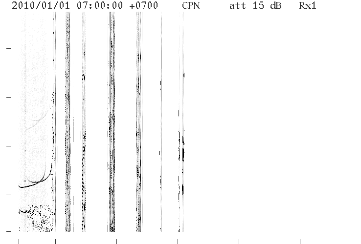
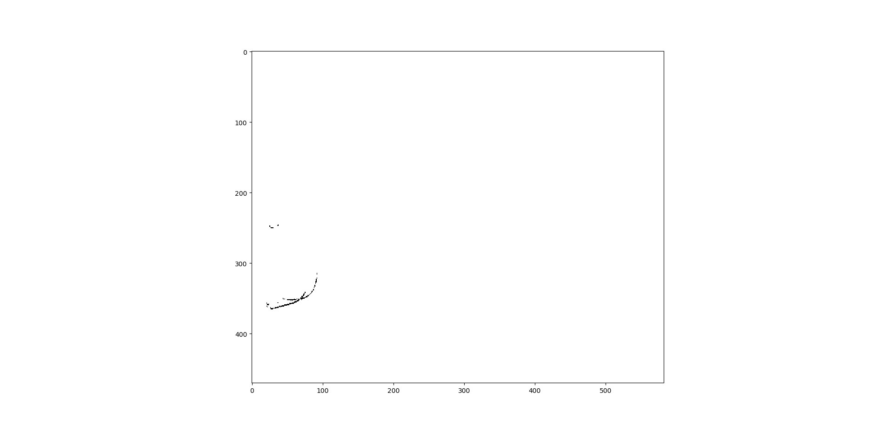

# pre_project @KMITL
Auto-scaling Ionogram
ใช้  python และ library ต่างๆ หาค่าจากรูป ionogram โดยรูป ionogram ภาพที่แสดงขีดจำจัดของความถี่ที่สามารถส่งขึ้นไปบนชั้นบรรยากาศและยังสามารถสะท้อนกลับมาได้
ซึ่งไม่ทะลุออกไปนอกโลก 

โดยนี่เป็นตัวอย่างของภาพ Ionogram 

และนี่คือผลหลังจากการประมวลฟผล

